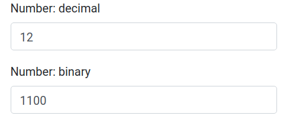

# Changement de base

## 01 Exercice Partie 1 

Vous allez créer un script React permettant de réaliser une conversion de nombre décimal vers un nombre binaire. 

Créez deux composants **App** et **BaseNumberInput**. Le composant App contiendra deux composants BaseNumberInput : respectivement pour saisir le nombre décimal et afficher le nombre binaire.

```txt

Nombre décimal : [ ... ]
Nombre binaire : [ ... ]

```

Hiérarchie des composants :

```txt
                 App
                .    .
            .            .
BaseNumberInput    BaseNumberInput
```

Dans le composant BaseNumberInput l'attribut onChangeBase sera appelé dans le composant lui-même. La logique algorithmique du changement de base sera implémentée dans le composant parent App (méthode this.handleChange) :

```js

<BaseNumberInput onChangeBase={handleChange} />

// Dans le composant BaseNumberInput
props.onChangeBase(e.target.value)

```

Indication de code :

```js
// Dans App on aura
const handleChange = (number, base) => {
   // ICI la logique de votre code
}

/* ----------------------- */

// Dans BaseNumberInput
const handleChange = e => {
  props.onChangeBase( e, 1 );
}
// rendu du composant BaseNumberInput
<input type="text" onChange={handleChange} />
```



## 02 Exercice Partie 1 

Implémentez la logique dans l'autre sens : si on rentre un nombre binaire dans le champ correspondant alors la conversion se fait dans l'autre sens (binaire vers décimal).

